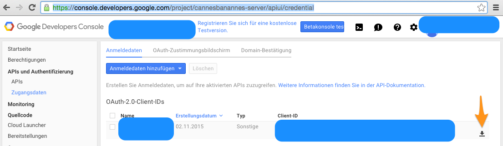

# glintcms-starter-cannesbanannes

This is a single page implementation with GlintCMS.
It shows how you can use GlintCMS.

> **it is a reservation system, that integrates with google calendar**
>
> for the google calendar api to work, you have to create your own account,
> enable the api, create the credentials,
> and store the client secret in: `./local_modules/widget-calendar/client_secret.json`

**links**

- read: https://developers.google.com/google-apps/calendar/quickstart/js

- download client_secret.json and store it under widget-calendar.

- https://console.developers.google.com/project/cannesbanannes-server/apiui/credential



> once you stored the client secret, run this script, follow what it asks you to do :-)

```sh
cd local_modules/widget-calendar/
node google-calendar-setup.js
```

# GlintCMS Documentation

- [documentation](https://github.com/glintcms/glintcms)
- [glintcms](http://glintcms.com/)


# prerequisites

make sure you have got [node.js](https://nodejs.org) installed on your system.

so far it has been tested with node 0.12.x and 4.x on mac os x and on ubuntu.

```bash
# for development, nodemon is helpful
npm install -g nodemon
```

# use

this starter contains a whole web site including the data storage.

It uses the filesystem as the storage adapter: `glint-adapter-fs`.

Therefore you don't have to install a database to run it.


## npm module

> you can install it as a module for your express or connect application.

#### install

```bash
# install in your app
npm install glintcms-starter-cannesbanannes --save

# copy the datastore into your app
cp -r node_modules/glintcms-starter-cannesbanannes/datastore/ datastore
```

#### run

> you can run it as a standalone application like this:

```javascript
var options = {};
var glintcms = require('glintcms-starter-cannesbanannes')(options);
glintcms.listen(process.env.PORT || 3000);
```

> or you can mount it into your web application:

```javascript
var express = require('express');
var app = express();
var options = {};
var glintcms = require('glintcms-starter-cannesbanannes')(options);

app.get('/', function(req, res, next){
  res.send('<h1>my new homepage</h1> check it out: <a href="/cms">GlintCMS</a>');
});

app.get('/cms', function(req, res, next){
  req.url = '/';
  next();
});

app.use(glintcms.app);

app.listen(process.env.PORT || 3000);
```


## standalone

> you can install it with git clone.
> this is the preferred way, when you want to take it as a starting point to develop your own app with GlintCMS

#### install

```bash
# change directory into the directory you want `glintcms-starter-cannesbanannes` to be created
git clone https://github.com/glintcms/glintcms-starter-cannesbanannes && cd glintcms-starter-cannesbanannes
# setup for production
npm run setup
# setup for development
npm run setup-www
```

#### run

```bash
# build it and run it
npm run build && node start

# or build for development
npm run build-www
# and start with automatic restart on file changes
npm run www

# if you want to run it with a specific port
export PORT=3000; npm run www

# start with specific options with the substack/subarg synthax
node start.js --upload [ --get /up* ]
```


# browse & edit

1. open the website: [http://localhost:8080/](http://localhost:8080/)
2. login via: [http://localhost:8080/login](http://localhost:8080/login)

**administrator**
- admin: `admin@cannesbanannes.com`
- password: `ContentContent`

**user**
- admin: `freunde@cannesbanannes.com`
- password: `Croisette`


# project structure

The directories `local_modules/*` contain the [local_modules](https://www.npmjs.com/package/local_modules) that are bundled with this starter project.
These modules are like normal unpublished npm modules, that are just contained in this project. It does not really make sense to publish them because they are very project specific.

The advantage to treat them as npm modules are:
- They are self contained and have defined dependencies in the `package.json`.
- It is easier to copy them into another project
- It lets you avoid [deep relative links](https://github.com/substack/browserify-handbook#avoiding-)


**During `development`**

These modules are symlinked into the `node_modules` directory, when running `npm run setup-www` or `local_modules link -f`


**In `production`**

When running `npm run setup` or `local_modules install -f` they are copied into the `node_modules` directory


# author

Andi Neck | [@andineck](https://twitter.com/andineck) | andi.neck@intesso.com | intesso


# get involved

Any Feedback is highly appreciated.
Please create an [Issue](https://github.com/glintcms/glintcms-starter-cannesbanannes/issues/new) or [PR](https://github.com/glintcms/glintcms-starter-cannesbanannes/pulls).
I'm happy to add you as a comitter too.


# license

MIT

